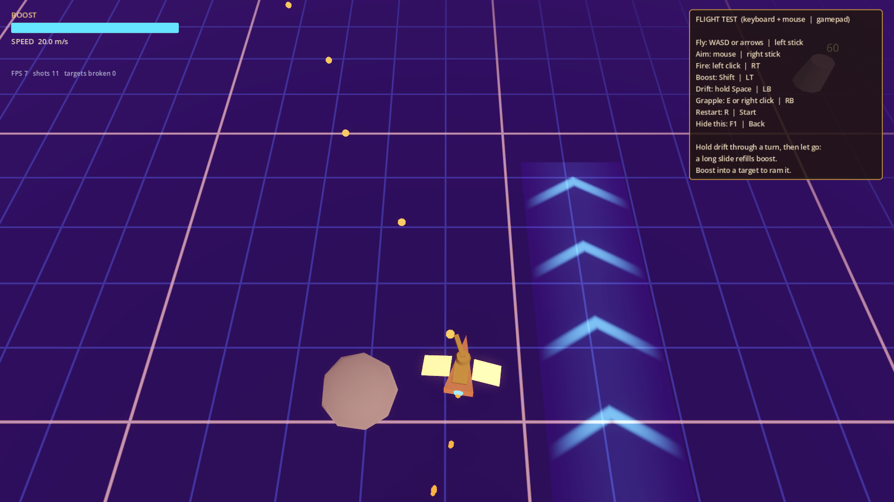

# Rift Runners (Project Star Dust)

A sci-fi roguelike looter with space-pirate aesthetics, fast movement and procedural Void Rifts. Built in **Godot 4** (GDScript). Design doc: *Rift Runners: Game Design Document* (Claude Doc in the project).



## Run it

1. Install **Godot 4.4 or newer** (standard build, not .NET). 4.4 through 4.7 are tested.
2. Open Godot, click **Import**, pick `project.godot` in this folder, then **Import & Edit**.
3. Press **F5** (or the ▶ button top right). The flight test arena starts.

The first open takes a few seconds while Godot imports the project.

## Controls (flight test)

| Action | Keyboard + mouse | Gamepad |
| --- | --- | --- |
| Fly | WASD or arrows | Left stick |
| Aim | Mouse | Right stick |
| Fire | Left click | RT |
| Boost | Shift | LT |
| Drift | Hold Space | LB |
| Grapple | E or right click | RB |
| Restart | R | Start |
| Show/hide help | F1 | Back |

Things to try: hold drift through a turn and let go for a **perfect drift** (refills boost), grapple an asteroid and swing round it, ride the blue **wind streams** for extra speed, boost into a target to **ram** it.

## Tuning the feel

All handling numbers live in `resources/ships/sloop_stats.tres`. Open it in the Godot inspector, change values and press F5 again; each one has a tooltip. To tweak live, run the game, open the **Remote** tab in the Scene dock, select `PlayerShip` and edit its `stats` there. Camera numbers (tilt, distance, look-ahead, boost zoom, shake) are on the `RiftCamera` node in `scenes/test/flight_test.tscn`. Grapple and cannon numbers are on the `Grapple` and `Cannon` nodes in `scenes/ship/player_ship.tscn`.

## Layout

```
project.godot            engine settings and input map
scenes/
  test/flight_test.tscn  milestone 1 grey-box arena (main scene)
  ship/player_ship.tscn  player ship: hull, turret, cannon, grapple
  world/                 asteroid, target dummy, wind stream
  combat/                projectiles
  ui/                    debug HUD
scripts/
  ship/                  flight model (ShipController), stats, input, grapple
  camera/                tilted look-ahead camera (RiftCamera)
  combat/                cannon and projectile
  world/                 targets, asteroids, wind streams
  ui/                    HUD
resources/ships/         per-hull ShipStats (.tres)
shaders/                 grid floor and wind stream shaders
assets/                  art/audio; every file listed in ASSET_LEDGER.csv
tests/smoke_test.gd      headless gameplay smoke test
tools/                   asset ledger check, arena layout generator
```

### Architecture notes

- **Input is separate from rules.** `ShipController` never reads the keyboard or gamepad. It asks its `input_source` for a `ShipIntent` each physics tick. `PlayerShipInput` is one source; the smoke test uses a scripted one. A co-op player or AI pilot is just another source.
- **No singletons** that assume one player. The camera and HUD are pointed at a ship, not at "the player".
- **Stats are Resources**, so new hulls are new `.tres` files and hub upgrades can produce modified copies later.

## Assets and AI tagging

Every file under `assets/` has a row in `assets/ASSET_LEDGER.csv` (path, source, author, license, ai_generated, tool, notes). AI-generated files live under `assets/_ai_generated/` **and** end in `__AI` (for example `icon__AI.svg`), so searching for `__AI` finds them all. `python3 tools/check_asset_ledger.py` enforces this and runs in CI.

## Checks

```
python3 tools/check_asset_ledger.py
godot --headless --import
godot --headless --script res://tests/smoke_test.gd
```

The smoke test loads the arena and checks thrust, speed caps, boost, perfect drift, shooting and target respawn, grapple orbit, wind streams and camera framing. CI runs all three on every pull request.

## Milestones (from the GDD)

1. **Flight feel** (this) - movement, boost, drift, grapple, camera in a grey-box arena.
2. Combat and mining - two weapons, two enemy types, mineable asteroids, cargo hold.
3. One rift - zone-graph generator from grey-box chunks, instability meter, extraction, death and loss.
4. Dual economy - augment caches and 10 augments, loot tables, run and profile inventories, saving.
5. Hub - shipwright, gate selection, spending cargo on parts. Full loop end to end.
6. Content and art pass.
7. Polish and performance (Steam Deck / GTX 1060 at 60 fps).
