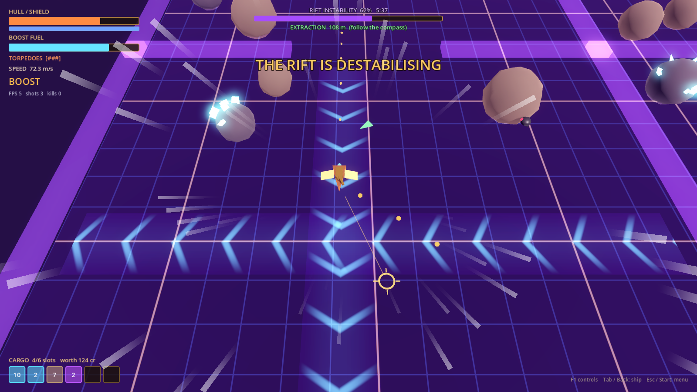

# Rift Runners (Project Star Dust)

A sci-fi roguelike looter with space-pirate aesthetics, fast movement and procedural Void Rifts. Built in **Godot 4** (GDScript). Design doc: *Rift Runners: Game Design Document* (Claude Doc in the project).



## Run it

1. Install **Godot 4.6 or newer** (standard build, not .NET). 4.6 and 4.7 are tested.
2. Open Godot, click **Import**, pick `project.godot` in this folder, then **Import & Edit**.
3. Press **F5** (or the ▶ button top right). The start screen opens: **Enter the Rift** opens the save screen (continue, load a slot or start a new game), then the hangar, where you pick a site on the **star chart** to start a run. A new save starts with the tutorial: a debris field called the graveyard, where you salvage the Rift Compass from a dead rift runner's derelict. The two test arenas (combat and flight) are on the start screen too.

The first open takes a few seconds while Godot imports the project.

## Controls

Twin-stick: fly with one hand, aim with the other.

| Action | Keyboard + mouse | Gamepad |
| --- | --- | --- |
| Fly (the nose turns toward this direction) | WASD or arrows | Left stick |
| Aim cannon | Mouse | Right stick |
| Fire cannon | Left click | RT |
| Fire torpedo (3 charges, refill over time) | Right click | RB |
| Brake | Ctrl | LT |
| Boost (hold, burns fuel) | Shift | A |
| Drift (hold) | Space | B or LB |
| Jettison last cargo slot | X | X |
| Ship screen (stats, skills, augments, cargo) | Tab | Back |
| Pause menu (resume, restart, main menu, quit) | Esc | Start |
| Restart (test arenas only) | R | |
| Show/hide controls | F1 | |

**In a rift:** each run builds a new rift from hand-made chunks. Mine, loot wrecks and fight your way to an extraction beacon (the green arrow on the edge of the screen, your Rift Compass reading, points to the nearest one; red edge arrows show nearby enemies off screen; the minimap in the top right fills in as you explore, with enemies in red sized by threat, ore in its colour, crates, wrecks and the exits), then hold position in the ring to escape with your cargo. Rift instability climbs the whole time (a full collapse takes 5 minutes, with a countdown from 50%): more stray enemies warp in as it rises, and at 100% the rift collapses and tears your hull apart.

**Rift tears:** rifts (not debris fields) are cut into sections of 1 to 3 chunks, far apart in space. The only way between sections is a **rift tear**, a glowing violet crack near a wall: fly into it and it pulls you through to its partner tear in the next section, keeping your speed. Tears work both ways (with a short cooldown so you don't bounce straight back) and enemies don't follow. The exit is in the last section; side sections are optional dead ends with extra loot. While the exit is in another section, the green arrow and the HUD point at the tear that leads toward it, and the minimap shows only the section you're in.

**Loot and the hangar:** fly into a glowing teal **augment cache** (some chunks have one, and pirate cutters sometimes drop one) to pick one of three augments. Augments boost the ship for this run only and stack. Extract and the hold sells for credits while augments break down into **Void Essence**. Die and the augments are lost and the hold with them, except the **Secured Locker** (your most valuable cargo slot), which still pays out. Between runs the hangar's shipwright sells permanent upgrades (hull, shields, cargo racks, cannon, torpedoes, engine) for credits and essence. **Hull damage carries over** between runs: scrap from the hold goes to the shipwright's stash (not sold), and repairs spend scrap first (1 scrap = 5 hull) and credits for the rest (3 cr per hull). Spare scrap can be sold for 2 cr each. Lose your ship and it's towed home at 25% hull.

**The star chart:** **debris fields** (tier 0) are small and safe-ish: no instability clock, drones only, no augments and no void crystals, just scrap and common ore for repairs. **Rifts** come in tiers I to III: each deeper tier is bigger, its hostiles have more hull and hit harder, the collapse comes sooner, and the hold sells for more (+30% at II, +60% at III). The Rift Compass from the tutorial opens tier I, and extracting from your deepest open tier unlocks the next. Site numbers live in `scripts/economy/deployment.gd`. Progress is saved in one of 3 save slots, picked on the save screen after **Enter the Rift** (Continue, New game, Play or Delete; delete asks twice). The files are `user://saves/slot_N.json` (on Windows: `%APPDATA%\Godot\app_userdata\Rift Runners\saves\`). Saves from an older version can't be loaded and show up as such; the old single `profile.json` from milestone 4 is removed automatically.

In the combat arena (a test level): shoot the asteroids with glowing crystals to chip ore loose and fly close to scoop it up (torpedoes crack them fastest). Waves of scavenger drones and pirate cutters warp in, marked by a purple flash; they drop scrap. Your hold has 6 slots, and if your hull is destroyed you lose everything in it and respawn at the centre.

Things to try: hold drift while turning so the ship slides. The sparks turn blue, then orange as the drift charges; let go for a speed kick in the direction you're pointing plus some boost fuel back. Ride the blue **wind streams** for extra speed, and boost into a target to **ram** it.

## Look and sound (placeholders)

The ships (player sloop, pirate cutter, scavenger drone) and the wreck are low-poly models built by `tools/make_models.py`; their materials live in `resources/materials/`. The rift's nebula backdrop, energy walls and lumpy rocks are shaders in `shaders/`. Sound effects and the two music loops (rift, hub) are synthesized by `tools/make_sounds.py`. Everything generated is tagged `__AI`, sits under `assets/_ai_generated/` and has a row in `assets/ASSET_LEDGER.csv`, so it can be found and replaced. To swap a sound, drop a new file over the same name (or add it to `OVERRIDES` in `scripts/audio/sfx.gd`). Music and sound volume sliders are in the pause menu.

## Tuning the feel

All handling numbers live in `resources/ships/sloop_stats.tres`. Open it in the Godot inspector, change values and press F5 again; each one has a tooltip. To tweak live, run the game, open the **Remote** tab in the Scene dock, select `PlayerShip` and edit its `stats` there. Camera numbers (tilt, distance, look-ahead, boost zoom, shake) are on the `RiftCamera` node in `scenes/test/flight_test.tscn`. Weapon, hull, shield and cargo numbers are on the `Cannon`, `Torpedoes`, `Health` and `Cargo` nodes in `scenes/ship/player_ship.tscn`. Enemies are `scenes/enemies/*.tscn`: their handling is in `resources/ships/`, and their behaviour (range, circling, burst fire) is on their `Input` node. Wave sizes are on `EncounterDirector` in `scenes/test/combat_test.tscn`, and the asteroid layout (seed, counts) on its `Asteroids` node. Rift tuning (run length, stray spawn rate, collapse damage, fixed seed) is on the root of `scenes/rift/rift_run.tscn`, and map size on its `Generator` node.

### Building rift chunks

Chunks live in `scenes/rift/chunks/`. Each is a `RiftChunk` (80 x 80 m) holding rocks, ore, wrecks, crates, wind streams and `EnemySpawnPoint` markers (pick the enemy and a spawn chance). Leave a clear cross about 12 m either side of the middle, because doorways open at the middle of each edge; the generator rotates chunks and builds the walls itself. Set `kind` (start, extract, normal), `weight` and `min_depth` on the root, then add the scene to the matching list on the `Generator` node. Exits are never placed closer than `min_exit_depth` chunks of travel (4) or `min_exit_spread` grid cells in a straight line (3) from the start; both are on the `Generator` node.

## Layout

```
project.godot            engine settings and input map
scenes/
  ui/main_menu.tscn      start screen (main scene)
  ui/save_select.tscn    pick, start or delete a save slot
  ui/hangar.tscn         the hub: star chart, repairs, upgrades, last run
  rift/rift_run.tscn     a rift run: generator, player, UI
  rift/chunks/           hand-made rift pieces
  rift/augment_cache.tscn  pick-one-of-three augment cache
  rift/compass_derelict.tscn  the tutorial's derelict holding the Rift Compass
  test/combat_test.tscn  milestone 2 combat and mining arena
  test/flight_test.tscn  milestone 1 flight arena
  ship/player_ship.tscn  player ship: hull, weapons, health, cargo, effects, reticle
  enemies/               scavenger drone, pirate cutter
  world/                 asteroids (plain and ore), wrecks, salvage crates, target dummy, wind stream
  combat/                projectiles, torpedo, explosions
  cargo/                 loose cargo pickup
  ui/                    HUD, minimap, pause menu, ship screen, augment picker, end-of-run card, screen effects
scripts/
  ship/                  flight model (ShipController), stats, input, effects, reticle
  ai/                    enemy pilots (AIPilot)
  camera/                tilted look-ahead camera (RiftCamera)
  combat/                weapons, projectiles, explosions, health, hit flashes
  cargo/                 item definitions, cargo hold, pickups, loot drops
  rift/                  rift generator, run rules (instability, extraction, payout), augment caches
  economy/               augments, ship loadout (upgrades + augments -> live stats), Profile save and upgrade shop
  world/                 targets, asteroids, mining, crates, wind streams, waves, layout
  fx/                    hitstop
  ui/                    HUD, menus, scene switching
resources/ships/         per-hull ShipStats (.tres), enemies included
resources/items/         one ItemDefinition per kind of loot (scrap, ore, void crystal)
resources/augments/      the 10 augments (AugmentDefinition .tres)
resources/ui/            menu theme
shaders/                 grid floor, wind stream, screen effects and menu starfield
assets/                  art/audio; every file listed in ASSET_LEDGER.csv
tests/                   headless smoke tests (flight, combat, rift and menus, economy)
tools/                   asset ledger check
```

### Architecture notes

- **Input is separate from rules.** `ShipController` never reads the keyboard or gamepad. It asks its `input_source` for a `ShipIntent` each physics tick. `PlayerShipInput` is one source; the tests use a scripted one, and enemies use `AIPilot`, so they fly by the same rules as the player. A co-op player is just another source.
- **Ships are built from parts.** Weapons (`ShipWeapon`, primary or heavy slot), `Health` (hull and shields) and `CargoHold` are child nodes, and teams decide who can hurt whom. Enemies are the same `ShipController` with different parts and stats.
- **No singletons** that assume one player. The camera and HUD are pointed at a ship, not at "the player".
- **Stats and loot are Resources**, so new hulls, items and augments are new `.tres` files. A ship's `ShipLoadout` child turns upgrades and augments into live numbers on a duplicated copy of its stats, so the shared `.tres` never changes.
- **The save is one static class** (`Profile`), not an autoload, so `project.godot` stays untouched.

## Assets and AI tagging

Every file under `assets/` has a row in `assets/ASSET_LEDGER.csv` (path, source, author, license, ai_generated, tool, notes). AI-generated files live under `assets/_ai_generated/` **and** end in `__AI` (for example `icon__AI.svg`), so searching for `__AI` finds them all. `python3 tools/check_asset_ledger.py` enforces this and runs in CI.

## Checks

```
python3 tools/check_asset_ledger.py
godot --headless --import
godot --headless --script res://tests/smoke_test.gd
godot --headless --script res://tests/combat_test.gd
godot --headless --script res://tests/rift_test.gd
godot --headless --script res://tests/economy_test.gd
```

The flight test checks thrust, braking, steering, hold-to-burn boost, drift charge and kick, shooting and target respawn, the aim reticle, wind streams and camera framing. The combat test checks mining, cargo pickup and limits, jettison, torpedoes, both enemy types, shields, death and respawn, and waves. The rift test checks the generated layout (reachable chunks, doorways and walls, exits kept away from the start, enemies, same seed = same rift), the minimap, instability and stray arrivals, the collapse countdown, the edge arrows, extraction, collapse and death, the pause menu and ship screen (including the real Tab key), the boost camera, augment caches, the extraction payout, the Secured Locker, the hangar's star chart and shipwright, debris field and tier rules, hull carry-over, the tutorial compass and the save screen. The economy test also covers save slots and old-version saves. The economy test checks augment and upgrade maths, the augment catalog, and saving and buying with the profile. Tests use their own save file. CI runs all of them on every pull request.

## Milestones (from the GDD)

1. **Flight feel** (done) - movement, boost, drift, camera in a grey-box arena. (The grapple was cut from core movement; it may return as a salvage-grabbing augment.)
2. **Combat and mining** (done) - cannon and torpedoes, scavenger drones and pirate cutters, mineable asteroids, cargo hold.
3. **One rift** (done) - generator from 8 grey-box chunks, instability, stray arrivals, extraction, death and loss. Also the start screen, pause menu, ship screen and game-feel pass.
4. **Dual economy** (done) - minimap and exit-distance rule, 10 augments in caches, credits and Void Essence, Secured Locker, saved profile, permanent upgrades at a stand-in hangar. Later: richer loot tables and an item stash at the hub.
5. **Hub** (done) - star chart with debris fields and rift tiers I to III, shipwright repairs with hull damage carried over, and the tutorial debris field where you find the Rift Compass. Later: spending cargo on parts, a real hub scene.
6. **Content and art pass**, split up: 6a look and sound (done), 6b rift tears between sections (this), 6c nine-enemy roster, 6d mini-boss vaults and lock-in, 6e an interactive port hub you fly around, 6f loadouts, 6g more chunks, themes and loot.
7. Polish and performance (Steam Deck / GTX 1060 at 60 fps).
