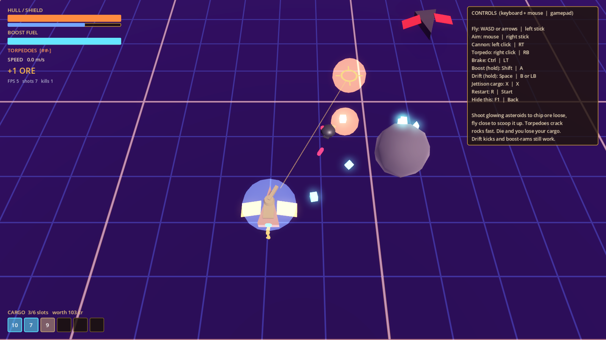

# Rift Runners (Project Star Dust)

A sci-fi roguelike looter with space-pirate aesthetics, fast movement and procedural Void Rifts. Built in **Godot 4** (GDScript). Design doc: *Rift Runners: Game Design Document* (Claude Doc in the project).



## Run it

1. Install **Godot 4.6 or newer** (standard build, not .NET). 4.6 and 4.7 are tested.
2. Open Godot, click **Import**, pick `project.godot` in this folder, then **Import & Edit**.
3. Press **F5** (or the ▶ button top right). The combat and mining arena starts. To fly the older flight-only arena, open `scenes/test/flight_test.tscn` and press **F6**.

The first open takes a few seconds while Godot imports the project.

## Controls

Twin-stick: fly with one hand, aim with the other.

| Action | Keyboard + mouse | Gamepad |
| --- | --- | --- |
| Fly (the nose turns toward this direction) | WASD or arrows | Left stick |
| Aim cannon | Mouse | Right stick |
| Fire cannon | Left click | RT |
| Fire torpedo (3 charges, refill over time) | Right click | RB |
| Brake | Ctrl | LT |
| Boost (hold, burns fuel) | Shift | A |
| Drift (hold) | Space | B or LB |
| Jettison last cargo slot | X | X |
| Restart | R | Start |
| Show/hide help | F1 | Back |

In the combat arena: shoot the asteroids with glowing crystals to chip ore loose and fly close to scoop it up (torpedoes crack them fastest). Waves of scavenger drones and pirate cutters warp in, marked by a purple flash; they drop scrap. Your hold has 6 slots, and if your hull is destroyed you lose everything in it and respawn at the centre.

Things to try: hold drift while turning so the ship slides. The sparks turn blue, then orange as the drift charges; let go for a speed kick in the direction you're pointing plus some boost fuel back. Ride the blue **wind streams** for extra speed, and boost into a target to **ram** it.

## Tuning the feel

All handling numbers live in `resources/ships/sloop_stats.tres`. Open it in the Godot inspector, change values and press F5 again; each one has a tooltip. To tweak live, run the game, open the **Remote** tab in the Scene dock, select `PlayerShip` and edit its `stats` there. Camera numbers (tilt, distance, look-ahead, boost zoom, shake) are on the `RiftCamera` node in `scenes/test/flight_test.tscn`. Weapon, hull, shield and cargo numbers are on the `Cannon`, `Torpedoes`, `Health` and `Cargo` nodes in `scenes/ship/player_ship.tscn`. Enemies are `scenes/enemies/*.tscn`: their handling is in `resources/ships/`, and their behaviour (range, circling, burst fire) is on their `Input` node. Wave sizes are on `EncounterDirector` in `scenes/test/combat_test.tscn`, and the asteroid layout (seed, counts) on its `Asteroids` node.

## Layout

```
project.godot            engine settings and input map
scenes/
  test/combat_test.tscn  milestone 2 combat and mining arena (main scene)
  test/flight_test.tscn  milestone 1 flight arena
  ship/player_ship.tscn  player ship: hull, weapons, health, cargo, effects, reticle
  enemies/               scavenger drone, pirate cutter
  world/                 asteroids (plain and ore), target dummy, wind stream
  combat/                projectiles, torpedo, explosions
  cargo/                 loose cargo pickup
  ui/                    debug HUD
scripts/
  ship/                  flight model (ShipController), stats, input, effects, reticle
  ai/                    enemy pilots (AIPilot)
  camera/                tilted look-ahead camera (RiftCamera)
  combat/                weapons, projectiles, explosions, health, hit flashes
  cargo/                 item definitions, cargo hold, pickups, loot drops
  world/                 targets, asteroids, mining, wind streams, waves, layout
  ui/                    HUD
resources/ships/         per-hull ShipStats (.tres), enemies included
resources/items/         one ItemDefinition per kind of loot (scrap, ore)
shaders/                 grid floor and wind stream shaders
assets/                  art/audio; every file listed in ASSET_LEDGER.csv
tests/                   headless smoke tests (flight, combat and mining)
tools/                   asset ledger check
```

### Architecture notes

- **Input is separate from rules.** `ShipController` never reads the keyboard or gamepad. It asks its `input_source` for a `ShipIntent` each physics tick. `PlayerShipInput` is one source; the tests use a scripted one, and enemies use `AIPilot`, so they fly by the same rules as the player. A co-op player is just another source.
- **Ships are built from parts.** Weapons (`ShipWeapon`, primary or heavy slot), `Health` (hull and shields) and `CargoHold` are child nodes, and teams decide who can hurt whom. Enemies are the same `ShipController` with different parts and stats.
- **No singletons** that assume one player. The camera and HUD are pointed at a ship, not at "the player".
- **Stats and loot are Resources**, so new hulls and items are new `.tres` files, and hub upgrades can produce modified copies later.

## Assets and AI tagging

Every file under `assets/` has a row in `assets/ASSET_LEDGER.csv` (path, source, author, license, ai_generated, tool, notes). AI-generated files live under `assets/_ai_generated/` **and** end in `__AI` (for example `icon__AI.svg`), so searching for `__AI` finds them all. `python3 tools/check_asset_ledger.py` enforces this and runs in CI.

## Checks

```
python3 tools/check_asset_ledger.py
godot --headless --import
godot --headless --script res://tests/smoke_test.gd
godot --headless --script res://tests/combat_test.gd
```

The flight test checks thrust, braking, steering, hold-to-burn boost, drift charge and kick, shooting and target respawn, the aim reticle, wind streams and camera framing. The combat test checks mining, cargo pickup and limits, jettison, torpedoes, both enemy types, shields, death and respawn, and waves. CI runs all of them on every pull request.

## Milestones (from the GDD)

1. **Flight feel** (done) - movement, boost, drift, camera in a grey-box arena. (The grapple was cut from core movement; it may return as a salvage-grabbing augment.)
2. **Combat and mining** (this) - cannon and torpedoes, scavenger drones and pirate cutters, mineable asteroids, cargo hold.
3. One rift - zone-graph generator from grey-box chunks, instability meter, extraction, death and loss.
4. Dual economy - augment caches and 10 augments, loot tables, run and profile inventories, saving.
5. Hub - shipwright, gate selection, spending cargo on parts. Full loop end to end.
6. Content and art pass.
7. Polish and performance (Steam Deck / GTX 1060 at 60 fps).
